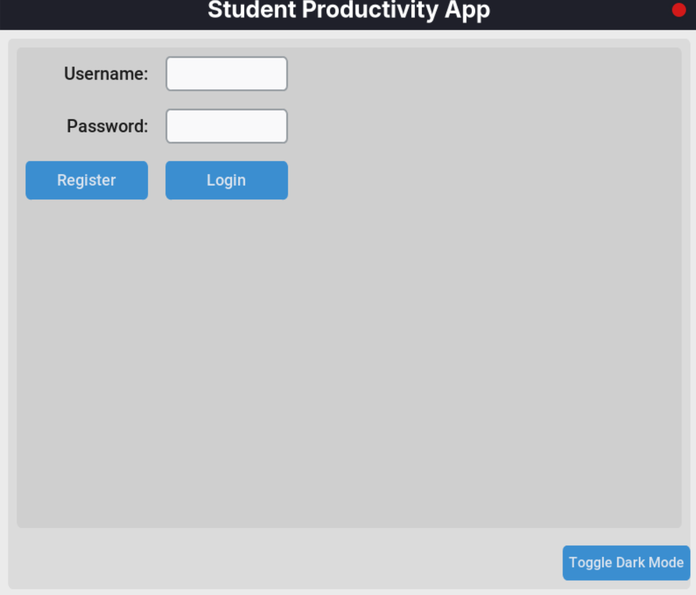
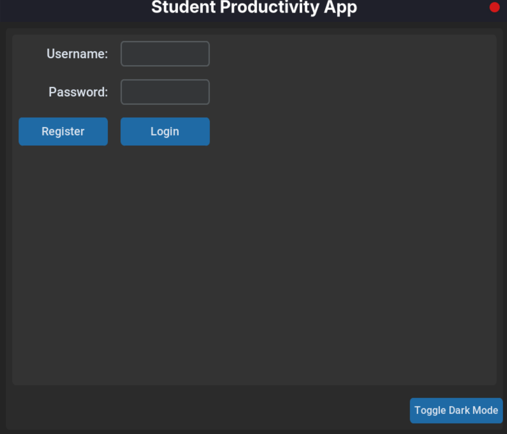
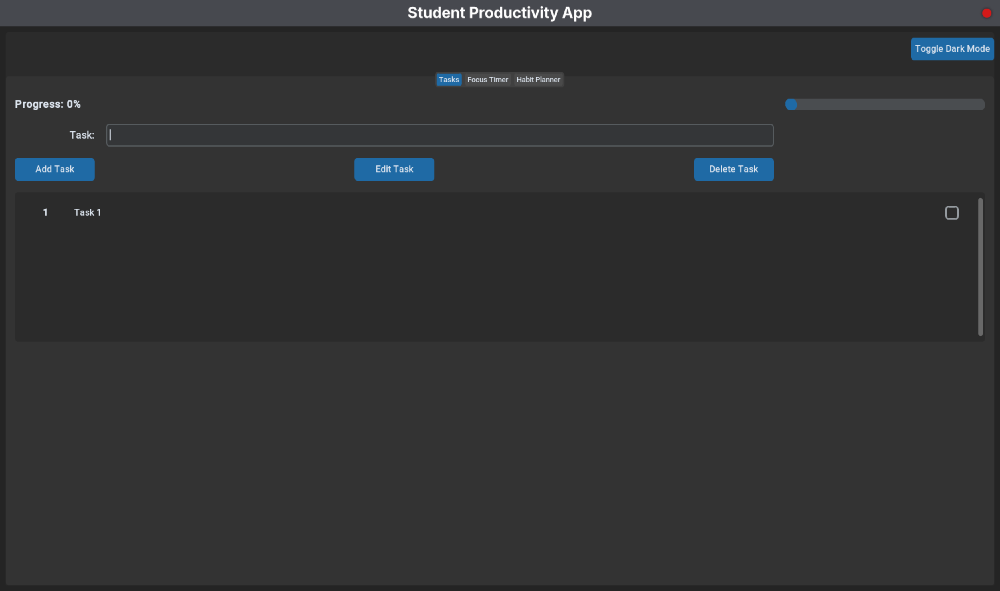
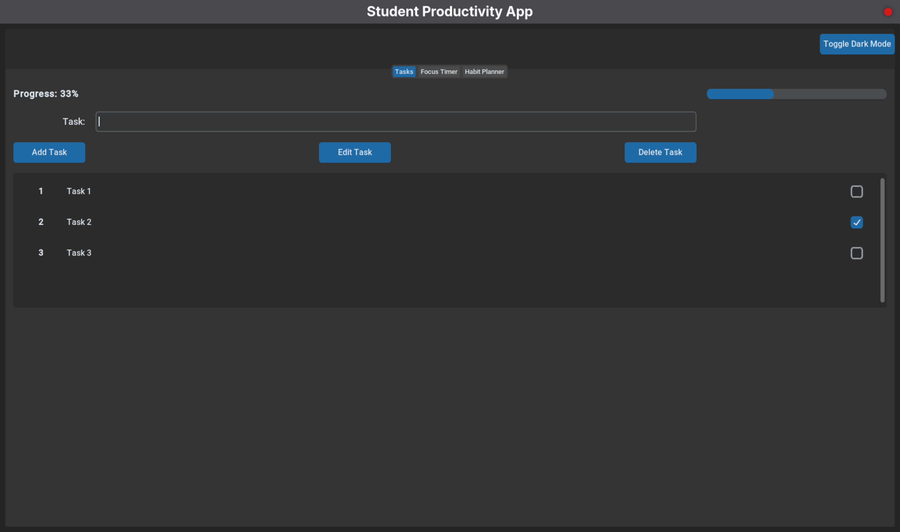

# How to use the App

The app has the following features

1. [Task Manager](#task-related-operations)
2. [Pomodoro Timer](#the-pomodoro-timer)
3. [Habit Tracker](#habit-tracker)

Once you run the command `just run` or `make run`, you are greeted with the following window. 

 

By default the app is in light mode. To change it to dark mode, click on the `Toggle Dark Mode` Button below. 

 

Now, enter you **Username** and **Password** and click on `Register` if you are using the app for the first time. If you have used the app earlier, enter your correct details and click on `Login`.

After you have registered yourself, click on `Login` to login to the app. 

Once you have logged in, you are greeted with this window. 

# Task related Operations

1. [Add new Task](#adding-a-task)
2. [Edit a Task](#editing-a-task)
3. [Tracking a Task](#tracking-task-progress)
4. [Delete a Task](#deleting-a-task)

## Adding a Task

Here, you can add your task on the input field and press **Add Task** Button to see the task. 

Here's how it'll look after you add a task. 

 

## Tracking Task progress

You can also track the status of those tasks (Completed or Pending), by checking the bok on the rightside next to the name of the task. 

Here's what it looks like. 

 

## Editing a Task

To edit a task, select the task you want to edit and click on **Edit Task**. You will see a window pop up with an input field for the new Task name. The process is outlined in the below video.

<video controls width="900">
    <source src="./images/edit_task.mp4" type="video/mp4">
</video>

 

## Deleting a Task 

Then to delete a task, we will select the task and them click on **Delete Task**. The task will then be deleted as shown in the below video.

<video controls width="900">
    <source src="./images/delete_task.mp4" type="video/mp4">
</video>

 

# The Pomodoro Timer

The StudentSync app also has an integrated Pomodoro Timer, which helps the students study for a certain time (25 minutes) and take a break (5 minutes). After 2 study sessions, there is a long break of 15 minutes. 

This system makes sure that the student isn't overwhelmed due to studies. 

To access the Pomodoro Timer, click on the **Focus Timer** tab. 

Here is the video of Pomodoro. 

<video controls width="900">
    <source src="./images/pomodoro.mp4" type="video/mp4">
</video>

 

# Habit Tracker

This is similar to Task Manager in the app. 
Here, you can add your routines and for how much time, you will perform your routines. 

Same as task, you can 

1. [Add New Routine](#adding-new-routine)
2. [Edit Routine]
3. [Tracking the Routine progress]
4. [Delete Routine]

## Adding new Routine

To add a new Routine, first go to the **Habit Planner** tab. 

Then enter your habit, with the time you will spend on that habit and click on **Add new Habit**

<video controls width="900">
    <source src="./images/habit_add.mp4" type="video/mp4">
</video>

 

## Editing a Routine

To edit a routine, select the routine you want to edit and the click on **Edit Routine**, you will now have to enter the new routine name and new time. 

