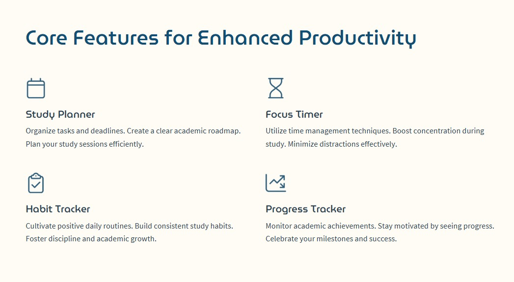

# Introduction

## The Team 

1. Vaishnav Sabari Girish (22BTREC021) (Team Leader)
2. Sinchan KN (22BTREI017)
3. Aryan R (22BTREI003)

## Problem Statement

Students today face growing academic pressure, juggling multiple subjects, assignments, and exams.
Poor time management, difficulty focusing, and inconsistent study habits often lead to missed
deadlines, stress, and reduced performance.
While various productivity tools exist, they are fragmented, internet-dependent, and not tailored for
student life. Students need a single, offline-capable platform that helps them plan their study
schedule, stay focused, track habits, and monitor their progress — all while maintaining data privacy
and simplicity.
There is a clear gap for a unified solution that supports students in building discipline, staying
motivated, and achieving consistent academic success.


<!--end_slide-->

# Abstract 

In today’s competitive academic environment, students often struggle with managing time, staying
focused, and maintaining consistent study habits. This project introduces a student productivity
application designed to help learners overcome these challenges by providing a structured,
goal-oriented digital workspace tailored to academic needs.
The application offers multiple key features that contribute to student productivity:

- A study planner that allows users to manage tasks, subjects, and deadlines in an organized
manner.
- A focus timer, inspired by the Pomodoro Timer, that promotes concentrated study
sessions with periodic breaks to reduce fatigue.
- A habit tracker that supports the development of positive daily routines such as reading,
regular sleep, hydration, and physical activity.

<!--end_slide-->

# Core Functions 



<!--end_slide-->

# Tools Used - 1

## Programming Languages used :

1. Python 3.13
2. Java OpenJDK 24.0.1 

## Front end 

1. **Tkinter**: Python’s standard library for creating graphical user interfaces. Used to build the login screen, tabs (Tasks, Focus Timer, Habit Planner), progress bars, and checkboxes.
    - **Modules Used**
        1. `tkinter`: Core module for window and widget creation (e.g., frames, buttons, entries).
        2. `tkinter.ttk`: Provides themed widgets (e.g., `Frame`, `Label`, `Entry`, `Button`, `Treeview`, `Progressbar`) for a modern look.
        3. `tkinter.messagebox`: Displays error and info dialogues (e.g., for login errors or timer alerts).
        4. `tkinter.simpledialog`: Creates input dialogues (e.g., for editing tasks).
        5. `tkinter.font`: Defines custom fonts (Helvetica 14pt for UI, 36pt for timer).
2. **Standard Libraries**
    - `subprocess`: Allows for the execution of command line arguments like for the Java back end.
    - `json`: Parses JSON responses from the back end to display tasks and habits in `Treeview`
    - `os`: Handles the file paths and working directory for back end calls.
    - `atexit`: Registers a cleanup function to terminal back end processes on exit.

<!--end_slide-->

# Tools Used - 2

## Back End 

The back end is built using Java and handles data storage, user authentication, and task/habit management, with serialization for persistence and AES for encryption.

1. **Standard Libraries**:
    - **java.io**
        1. `File`, `FileInputStream`, `FileOutputStream` to manage file based operations for `.ser` files (Serialized Java Object).
        2. `ObjectInputStream`, `ObjectOutputStream` to Serialize/Deserialize `User`, `Task` and `Habit` objects for persistent storage. 
        3. `IOException`: Handle file IO Errors 
    - **java.util**
        1. `ArrayList`: Stores lists of `User`, `Task`, and `Habit` objects in memory.
        2. `Base64`: Encodes/decodes AES-encrypted passwords.
    - **java.nio.charset.StandardCharsets**: Ensures UTF-8 encoding for string operations in encryption/decryption.
    - **javax.crypto**:
        1. `Cipher`: Performs AES encryption/decryption for passwords.
        2. `SecretKeySpec`: Manages the AES key (`MySecretKey12345`).
    - **java.lang**:
        1. `Exception`: Used for error handling across back end operations.
        2. `StringBuilder`: Builds JSON strings for task/habit lists.

<!--end_slide-->

# Output 

```bash +exec
just build
just run
```
